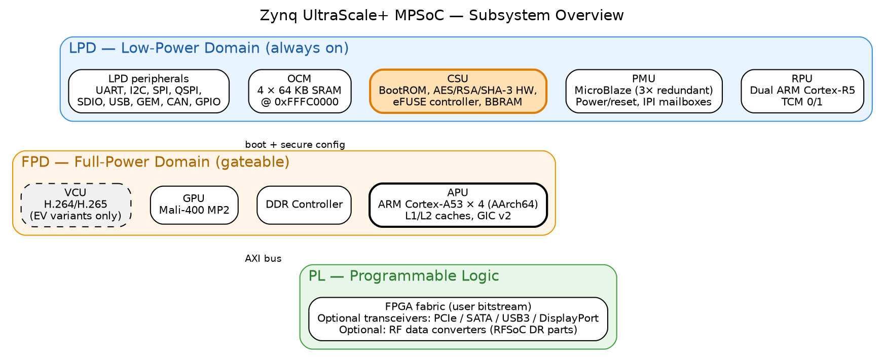
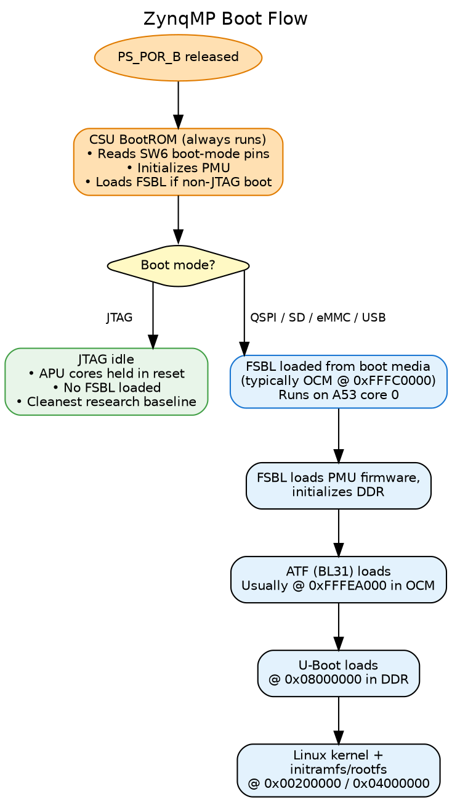
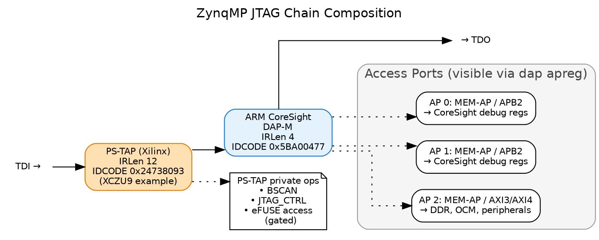

# JTAG Enumeration for Security Research on the Zynq UltraScale+ MPSoC

## 1. Introduction

### 1.1 Why JTAG enumeration matters

JTAG is the most privileged hardware-level debug interface on a modern
SoC. On an unhardened device, it provides:

- Read/write access to **every** memory location the SoC can address
- Halt and step control of **every** CPU (APU, RPU, PMU)
- Direct access to the security control unit's registers
- Read access to eFUSE shadow registers including device fingerprint, secure-boot policy, and PPK hashes
- The ability to release CPUs from reset and execute arbitrary code at
  **EL3** — the highest ARMv8 privilege level, above any OS, hypervisor,
  or TrustZone monitor

For an attacker with physical access, JTAG bypasses the operating system
entirely. For a defender, JTAG state is what the silicon actually
enforces — software-level hardening is irrelevant if the JTAG hardware
gates are wide open.

The first question on any new device is: **what is the silicon actually
gating, and what is it leaving open?** Answering it requires reading and
decoding roughly eighty registers across seventeen functional sections —
the security spine plus power, clocks, resets, A53 state, code-execution
discovery, debug topology, memory map probes, peripheral and memory
protection units, RPU configuration, IPC fabric, and FPGA configuration
status — plus tracking the live state of every domain that could be a
debug-relevant target. Doing this by hand is slow and error-prone. The
enumeration tool described in Volumes 2 and 3 does it in ten seconds
and produces a structured, diffable report.

---

## 2. Background

AMD's Zynq UltraScale+ MPSoC is the platform every step of this
workflow targets. The subsections below cover its high-level
architecture, variant landscape, boot model, JTAG security gates,
and memory layout — in the order needed to understand what
enumeration produces.

### 2.1 The ZynqMP SoC at a glance

The Zynq UltraScale+ MPSoC is a multi-die system-on-chip combining
several processor subsystems with FPGA fabric:

{width=100%}

Two power domains govern everything:

- **LPD** — Low-Power Domain. Always-on. Contains the RPU, PMU, CSU,
  OCM (on-chip SRAM), most peripherals
- **FPD** — Full-Power Domain. Can be gated off. Contains the APU,
  DDR controller, GPU, VCU, PCIe, SATA, USB3, DisplayPort, GIC

A device booted "JTAG-idle" with the FPD off can still service JTAG
debug because the LPD remains powered.

### 2.2 Boot model

The ZynqMP boot sequence is multi-stage:



**The JTAG-idle state is the cleanest baseline** for enumeration:
APUs are in reset, no FSBL has run, no secrets have been loaded into
peripherals, no peripheral interrupts are active. Most of this paper's
sample data comes from a ZCU102 in JTAG idle.

A device booted from SD/QSPI/eMMC produces a much richer enumeration
report because FSBL has run, DDR is initialized, PMU firmware is
running, peripherals are alive, and U-Boot or Linux may be visible in
memory. The two report types diff against each other to reveal what
the FSBL chain actually did.

### 2.3 JTAG security architecture

This is the part that drives most of the rest of the series.

#### JTAG chain composition

The ZynqMP exposes two TAPs in series on the JTAG chain:



The PS-TAP is Xilinx-proprietary; the ARM DAP is the standard
CoreSight ARM debug-access port. Both must be reachable for full
enumeration.

#### The CSU Secure Stream Switch (SSS)

The CSU implements a multi-input multi-output stream switch that
gates which JTAG paths can talk to which security-sensitive blocks.
Three SSS paths matter for JTAG enumeration:

```
JTAG ── ┬─► SSS_DAP_SEC ──► ARM DAP (APU, RPU debug)
        │
        ├─► SSS_PLTAP_SEC ──► PL TAP (FPGA fabric JTAG)
        │
        └─► SSS_PMU_SEC ──► PMU (firmware execution control)
```

Each path's gate is controlled by a **3-bit magic value** in
`CSU.JTAG_SEC` (at `0xFFCA0038`). Open requires `0b111`; any other
value gates the path. The 3-bit design is anti-glitch — a single bit
flip from fault injection cannot unlock a gated path.

#### Per-cluster debug authorization (JTAG_DAP_CFG)

A second register `CSU.JTAG_DAP_CFG` (at `0xFFCA003C`) controls what
the ARM DAP itself can do, with six 1-bit gates:

| Bit | Field | Effect |
|---|---|---|
| 0 | SSSS_APU_DBGEN | APU halt/step/breakpoint allowed (non-secure world) |
| 1 | SSSS_APU_NIDEN | APU non-invasive trace (ETM, etc.) allowed |
| 2 | SSSS_APU_SPIDEN | **APU SECURE-world debug allowed (EL3/TrustZone)** |
| 3 | SSSS_APU_SPNIDEN | APU secure-world trace allowed |
| 4 | SSSS_RPU_DBGEN | RPU (R5) debug allowed |
| 5 | SSSS_RPU_NIDEN | RPU trace allowed |

These are **cluster-wide**, not per-core. SPIDEN is the bit that
defines whether the device's secure-world is attackable via JTAG.

#### eFUSE secure-boot policy

Finally, the one-way fuses in `EFUSE.SEC_CTRL` (at `0xFFCC1058`)
control the silicon's secure-boot policy at hardware level:

| Bit(s) | Field | Effect when set |
|---|---|---|
| 0 | AES_RDLK | AES key in eFUSE cannot be read |
| 1 | AES_WRLK | AES key in eFUSE cannot be written |
| 2 | ENC_ONLY | Boot image MUST be encrypted |
| 3 | BBRAM_DIS | BBRAM disabled as key source |
| 5 | JTAG_DIS | **Hardware JTAG disable — irreversible** |
| 10 | SEC_LOCK | **Lock SEC_CTRL itself — no further fuses settable** |
| [25:11] | RSA_EN | 15-bit magic field requiring specific value to enforce RSA-signed boot |
| 26 | PPK0_WRLK | Primary Public Key 0 hash write-locked |
| [28:27] | PPK0_INVLD | 2-bit magic field; invalidates PPK0 |
| 29 | PPK1_WRLK | PPK1 hash write-locked |
| [31:30] | PPK1_INVLD | 2-bit magic field; invalidates PPK1 |

Two fields use magic-value patterns (RSA_EN, PPK_INVLD) rather than
single-bit enables — the same anti-glitch defense as the JTAG_SEC
gates. A successful glitch attack on a single bit cannot enable RSA
bypass or invalidate a PPK.

These three register groups — `JTAG_SEC`, `JTAG_DAP_CFG`, and
`EFUSE.SEC_CTRL` — define essentially the entire JTAG-visible security
policy of the device. Reading them is the heart of the enumeration
workflow described in Volume 2.

### 2.4 Memory layout overview

ZynqMP's address space (identical across MPSoC variants):

| Range | Block | Notes |
|---|---|---|
| `0x00000000 - 0x7FFFFFFF` | DDR (lower 2 GB) | Main system DRAM. Only accessible after DDR controller init by FSBL. |
| `0xC0000000 - 0xFCFFFFFF` | PL aperture / PCIe | Programmable Logic and PCIe BARs |
| `0xFD000000 - 0xFD0FFFFF` | DDR controller | |
| `0xFD1A0000 - 0xFD1AFFFF` | CRF_APB | FPD Clock/Reset (APLL/DPLL/VPLL, RST_FPD_*) |
| `0xFD400000 - 0xFD4FFFFF` | SERDES | Gigabit transceivers |
| `0xFD5C0000 - 0xFD5CFFFF` | APU registers | RVBARADDR0-3 reset vectors. APU power/reset. |
| `0xFD800000 - 0xFD9FFFFF` | GPU (Mali-400) | |
| `0xFE000000 - 0xFE00FFFF` | GIC distributor | |
| `0xFE100000 - 0xFE1FFFFF` | VCU (video codec) | EV variants only |
| `0xFF000000 - 0xFF0FFFFF` | PS UARTs, I2C, SPI, GPIO, QSPI | |
| `0xFF160000 - 0xFF17FFFF` | SDIO0/1 | |
| `0xFF300000 - 0xFF33FFFF` | IPI mailboxes | PMU↔APU↔RPU communication |
| `0xFF410000 - 0xFF41FFFF` | LPD_SLCR | |
| `0xFF5E0000 - 0xFF5EFFFF` | CRL_APB | LPD Clock/Reset (IOPLL/RPLL, BOOT_MODE, RST_LPD_*) |
| `0xFF9A0000 - 0xFF9AFFFF` | RPU configuration | |
| `0xFFC80000 - 0xFFCBFFFF` | CSUDMA + CSU | CSU at `0xFFCA0000` |
| `0xFFCC0000 - 0xFFCCFFFF` | eFUSE controller | DNA, SEC_CTRL, PPK hashes | <!-- verify-addresses:skip -->
| `0xFFCD0000 - 0xFFCDFFFF` | BBRAM | Battery-Backed RAM (AES key storage) |
| `0xFFCE0000 - 0xFFCEFFFF` | RSA core | Hardware RSA-2048/4096 |
| `0xFFD80000 - 0xFFD8FFFF` | PMU_GLOBAL | Power/reset of every domain |
| `0xFFDC0000 - 0xFFDDFFFF` | PMU RAM (LMB) | PMU firmware runs here |
| `0xFFE00000 - 0xFFE3FFFF` | RPU TCM | Tightly-Coupled Memory for R5 cores |
| `0xFFFC0000 - 0xFFFFFFFF` | OCM (4×64 KB SRAM) | Default FSBL/ATF load region |

This layout is identical across ZCU102/104/106, Ultra96, custom
ZynqMP boards, and RFSoCs — the variant-specific differences (VCU,
RF tiles, GPU presence) are bonded selections within these address
ranges, not different memory maps.

