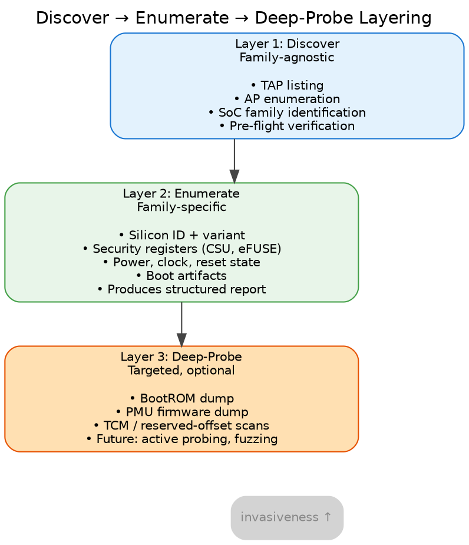
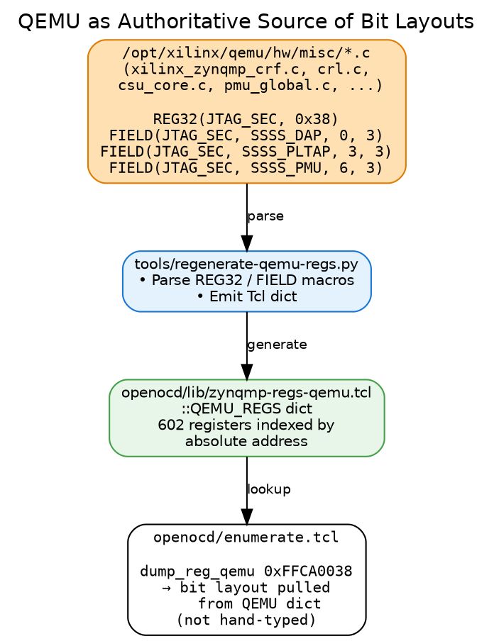
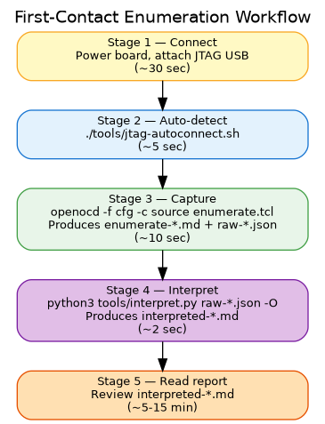

# JTAG Enumeration for Security Research on the Zynq UltraScale+ MPSoC

## Volume 2 — Methodology and Workflow

This volume describes how the enumeration toolset is structured (the
short methodology preface) and what running it actually looks like in
practice (the longer workflow section). A reader who only wants to know
"what do I do with this thing" can skim §1 and dive into §2.

A ZCU102 case study with real report excerpts is in §3.

---

## 1. Methodology Preface

The workflow is shaped by three design decisions. Understanding them
makes the rest of the document make sense and points at where future
extensions slot in.

### 1.1 Three-layer pipeline: discover → enumerate → deep-probe



Each layer is more invasive than the previous. Discovery is pure
metadata reads; enumeration reads ~80 SoC registers passively;
deep-probe touches large memory regions and may risk DAP wedges.
The layering keeps fast safe operations from being held hostage by
slow risky ones.

The **enumerate** layer itself is split into two stages: a Tcl
capture stage (`openocd/enumerate.tcl`, the only code that talks to
silicon) and a Python interpret stage (`tools/interpret.py`, which
applies curated annotations + cross-register rules to the captured
JSON). The two stages are described in §2.3 (Capture) and §2.4
(Interpret).

### 1.2 QEMU as the authoritative source of register layouts

Bit-field decodings in the enumeration script come from Xilinx's QEMU
register models, not from hand-typed datasheet transcriptions.



The C-language REG32/FIELD macros in QEMU's source are
"as-implemented" — they describe how the silicon actually responds,
not how a datasheet text describes it. By making them the canonical
source, the script cannot drift from real-silicon behavior through
human transcription error.

Originally a standalone audit tool (`tools/audit-bit-layouts.py`)
cross-checked every hand-typed `dump_reg` call against the QEMU model.
After all sites migrated to `dump_reg_qemu` (which pulls fields
directly from the QEMU dict at call time), the audit had nothing to
audit and was retired in May 2026 — drift is now structurally
impossible.

### 1.3 Variant lookup for within-family differences

The ZynqMP family includes dies with 2 or 4 A53 cores, some with VCU,
some with RF tiles, some with reduced GEM counts. The enumeration
script reads the IDCODE PART_ID and consults
`openocd/lib/zynqmp-variants.tcl` (25 entries) to obtain a capability
profile for the specific die. Variant-conditional probes use this
profile to avoid reading addresses that aren't present on the
detected die.

This pattern is preferable to per-variant scripts (which would
duplicate the same ~1100 lines of code N times) and to per-board
scripts (which would conflate "this die has VCU silicon" with "this
PCB exposes a VCU connector"). One script, one register library, one
variant table.

---

## 2. Workflow

This is the hands-on section. The workflow has five stages for a
first-contact unknown-board scenario; on a known board it collapses
to three steps (the auto-detect stage is skipped).



### 2.1 Stage 1 — Connect

Concrete steps for a ZCU102:

| Step | Action | Verify |
|---|---|---|
| 1 | Set boot mode switches SW6 to all-ON (JTAG idle) — for the cleanest baseline | Visual check |
| 2 | Connect 12V power supply to the board | Green PWR LED on |
| 3 | Connect the on-board Digilent SMT2 JTAG over a USB Micro-B cable to the host | Host sees new USB device |
| 4 | If running in a VM, pass the JTAG USB device through to the guest | `lsusb` in guest shows `0403:6014` |
| 5 | Press the POWER ON button (SW1) | Status LEDs come up |

For other boards the principle is the same: bring up power, connect
JTAG, pass USB through.

### 2.2 Stage 2 — Confirm the chain

Work targets a known board, so the OpenOCD config is fixed
(`openocd/zcu102.cfg` — the Digilent SMT2 interface plus the ZynqMP
target). Before trusting an enumeration, optionally run `discover.tcl`
to confirm the JTAG chain and AP topology match what you expect for the
part in front of you:

```
openocd -f openocd/zcu102.cfg -c "init; source openocd/discover.tcl; shutdown"
----------------------------------------------------------------
 JTAG CHAIN DISCOVERY
----------------------------------------------------------------
TAPs defined: 2
  - uscale.tap
  - uscale.ps
Access Ports visible on uscale.dap:
  AP 0: IDR = 0x44770002  MEM-AP  APB2/APB3 (debug-register access)
  AP 1: IDR = 0x44770002  MEM-AP  APB2/APB3 (debug-register access)
  AP 2: IDR = 0x24770004  MEM-AP  AXI3/AXI4 (memory access)
----------------------------------------------------------------
```

The TAP list and IDCODEs confirm the part; the AP list shows which
debug/memory access ports respond. On a different target board a
mismatch here is the first signal that the config (or the part) isn't
what you assumed — which AP responds is itself a posture datum.

### 2.3 Stage 3 — Capture (run enumerate.tcl)

The capture is one command:

```
openocd -f openocd/zcu102.cfg -c "init; source openocd/enumerate.tcl; shutdown"
```

In about ten seconds it produces three outputs:

| Output | Where | Use |
|---|---|---|
| Raw markdown | `reports/enumerate-<YYYY-MM-DD-HHMMSS>.md` | Human-readable transcript — addresses + per-bit decode for every register read |
| Raw JSON | `reports/raw-<YYYY-MM-DD-HHMMSS>.json` | Structured capture for the interpret stage (§2.4). Schema: `registers`, `variant`, `a53`, `boot_state`, `memory_probes`, `coresight`, `metadata` |
| Live terminal | stdout | Real-time progress; includes OpenOCD startup banner and per-section streaming output |

The raw markdown and the raw JSON cover the same data in two
formats. The interpreted markdown (produced in §2.4) is layered on
top of the JSON.

A clean run has these phases (visible in terminal):

```
OpenOCD startup:
   - JTAG chain scan, IDCODEs reported
   - Target examination (A53 cores held in reset → expected warnings)

Section-by-section enumeration:
   §1  JTAG Chain               (no probes — metadata)
   §2  Silicon Identity         (IDCODE, version, DNA, variant lookup)
   §3  Boot State               (boot mode pins, reset reason, multi-boot)
   §4  Security State           (JTAG_SEC, JTAG_DAP_CFG, EFUSE.SEC_CTRL — the security spine)
   §5  Power State              (PWR_STATE, error history)
   §6  Clocks                   (PLLs, per-peripheral REF_CTRLs)
   §7  Reset State              (per-domain and per-peripheral resets)
   §8  A53 Release              (writes to RST_FPD_APU to release core 0, halts in EL3)
   §9  Code Execution           (OCM scan, conditional DDR scan)
   §10 CoreSight Topology       (per-AP `dap info N` capture into JSON; each AP's ROM-table walk + component PIDs)
   §11 Memory Map Reference     (documentation table embedded in the report)
   §12 Memory Map Probe         (block accessibility check)
   §13 XPPU                     (LPD peripheral protection — CTRL, ISR, master-ID slots)
   §14 RPU Configuration        (Cortex-R5 cluster — global mode, per-core CFG/STATUS/SLV_BASE)
   §15 IPI (APU agent window)   (inter-processor interrupt fabric from APU's view)
   §16 XMPU                     (OCM_XMPU + DDR_XMPU0 — memory-range protection)
   §17 PL TAP + PCAP            (FPGA configuration status — PL_DONE, PL_EOS, etc.)
   Cleanup                      (re-asserts A53 reset for next-run cleanliness)
```

### 2.4 Stage 4 — Interpret (run interpret.py)

The capture stage produced a raw JSON; the interpret stage layers
findings + annotations on top of it. One command:

```
python3 tools/interpret.py "$(ls -t reports/raw-*.json | head -1)" -O
```

Produces `reports/interpreted-<YYYY-MM-DD-HHMMSS>.md`. The `-O` flag
auto-names the output to match the raw JSON's timestamp.

The interpreted report contains:

| Section | What's in it |
|---|---|
| Silicon identity table | Die, variant, DNA, silicon revision — from variant lookup |
| Findings (rules fired) | Each rule that fired gets a coloured severity glyph (CRITICAL / MAJOR / MINOR / INFO — markdown viewers render these as red/orange/yellow/blue circles), description, conclusion prose, and offensive implications |
| CoreSight DAP topology | Per-AP `dap info N` output rendered verbatim from the JSON |
| Captured registers + annotated meanings | Every captured register, every bit-field paired with its curated annotation when one exists |

**Format options.** Default is compact (≈1000 lines for ZCU102 in
JTAG-idle): each field gets one line packing name + bits + value +
label + meaning. Pass `--full` for the verbose archival layout
(≈1800 lines) with each field's annotation on its own indented sub-bullet.

```
python3 tools/interpret.py reports/raw-<ts>.json --full -O   # verbose
python3 tools/interpret.py reports/raw-<ts>.json -O          # compact (default)
```

### 2.5 Stage 5 — Read the report

You have two markdown reports per run: the raw enumerate report
(what silicon returned) and the interpreted report (what it means).
For day-to-day work, read the interpreted report. The raw one is for
when you need to confirm an exact register value, diff against
another board byte-for-byte, or hand to a reviewer who wants the
unmediated transcript.

Useful reading flow for the **interpreted** report:

1. **Read the Findings section first.** This is the rule output —
   on a stock ZCU102 in JTAG-idle, expect ~10 findings, mostly INFO
   with one CRITICAL (SPIDEN — secure-world TrustZone debug enabled).
   Each finding tells you what fired and why it matters.
2. **Skim the Silicon identity table** — confirm which die you're
   on (XCZU9 for ZCU102) and write down the DNA if you'll be
   comparing across sessions.
3. **Scroll to §4 in the per-register dump** — verify the security
   spine fields (CSU.JTAG_SEC, JTAG_DAP_CFG, EFUSE.SEC_CTRL) match
   what the Findings section claimed.
4. **Glance at §8** — confirm A53 release succeeded (PC ends up at
   `0xFFFC0000`, our safe-landing instruction). If it didn't, the
   board needs power-cycling.
5. **Skim §9** — for booted devices, this scans OCM and DDR for
   known boot artifacts. In JTAG-idle this section is mostly empty.

Sections 5, 6, 7, 13-17 are usually only worth reading when
something mismatched expectations (PLL not locked, peripheral
unexpectedly powered, XMPU violation latched, FPGA configured when
you expected JTAG-idle, etc.). The interpreted report calls those
out in the Findings section regardless.

For the operator's-eye-view of "what does each field mean, what
should I write down, what do I do if I see X" — see the companion
guide [`docs/guides/operator-quick-reference.md`](../guides/operator-quick-reference.md).

#### Reading a finding

Each fired rule in the interpreted report looks like this:

```
### [CRITICAL] Secure-world TrustZone debug enabled

_SPIDEN bit is set — JTAG can halt and inspect the EL3 monitor /
TrustZone secure world._

**Conclusion:** Secure-world debug is the single most consequential
JTAG security signal on ZynqMP. With SPIDEN=1, an attacker with
physical JTAG access can halt the A53 in EL3 (highest ARMv8
privilege)...

**Offensive implications:**

- Direct read of AES decryption keys from secure-world memory
- Direct read of attestation/identity material protected by TrustZone OS
- Halt and modify the EL3 monitor — TrustZone rootkit primitive
- ...
```

(In an actual markdown viewer, the `[CRITICAL]` placeholder is
rendered by `interpret.py` as a red filled circle; the PDF
representation here strips the glyph for font portability.)

The severity glyph, the rule name, the one-line description, the
conclusion prose, and the offensive-implications list all come from
the corresponding `rule_*` function in `docs/findings/zynqmp_rules.py`.

---

## 3. Case Study: ZCU102 in JTAG-Idle Mode

This section walks through real enumeration output from a ZCU102 dev
board in JTAG-idle (cleanest baseline). Excerpts are taken directly
from a saved report file; everything is reproducible from a fresh
power-on.

### 3.1 Silicon identity

Raw register dump (§2):

```
- CSU_IDCODE: 0xffca0040 = 0x24738093
    [ 0]     CONST_1     = 1
    [11: 1] MANUF_ID    = 0x49 (Xilinx, JEP106)
    [27:12] PART_ID     = 0x4738 (XCZU9 die)
    [31:28] REVISION    = 0x2  (silicon rev 2)

- CSU_VERSION: 0xffca0044 = 0x00000513
    [15:12] PLATFORM    = 0x0
    [ 3: 0] PS_VERSION  = 0x3 (production silicon)

eFUSE Device DNA (96 bits):
- DNA[31:0]:  0x44804345
- DNA[63:32]: 0x0170cfa7
- DNA[95:64]: 0x40000000
```

Findings table:

| Observation | Observed | Implication |
|---|---|---|
| Chip identity | XCZU9 (EG/CG) (4-core A53, family=zynqmp) | PART_ID 0x4738, silicon rev 2. Quad A53; ZCU102 ships with ZU9EG — no VCU on this die |
| Silicon variant | PS_VERSION=3 → production silicon | Production is common; ES1/ES2 = early revision with possible errata |
| Device DNA | `0x44804345` `0x0170cfa7` `0x40000000` | Unique per-chip ID; useful for fingerprinting |

Confirms: ZU9EG die, silicon rev 2, production silicon (not an
engineering sample), and the DNA we'll fingerprint against. The
"no VCU on this die" note comes from the variant lookup table —
even if the package suffix were EV, this specific die doesn't bond
VCU silicon.

### 3.2 Boot state

```
- CRL_APB.BOOT_MODE_USER: 0xff5e0200 = 0x00000000
    [15:12] ALT_BOOT_MODE = 0x0
    [ 8]    USE_ALT       = 0
    [ 3: 0] BOOT_MODE     = 0x0  (JTAG idle)

- CRL_APB.RESET_REASON: 0xff5e0220 = 0x00000001
    [ 0]    EXTERNAL_POR  = 1
    ... (all other bits 0)
```

Findings table:

| Observation | Observed | Implication |
|---|---|---|
| Boot mode | 0 → JTAG idle | Cleanest research baseline. No FSBL ran. APU cores in reset. Only BootROM executed. |
| Reset reason | EXTERNAL_POR | Fresh baseline — POR only, no prior software state. |

We're in the cleanest possible state for enumeration.

### 3.3 Security state — the most important section

```
- CSU.JTAG_SEC: 0xffca0038 = 0x0000003f
    [ 8: 6] SSSS_PMU_SEC   = 0x0  (PMU path gated)
    [ 5: 3] SSSS_PLTAP_SEC = 0x7  (PL TAP path open)
    [ 2: 0] SSSS_DAP_SEC   = 0x7  (DAP path open)

- CSU.JTAG_DAP_CFG: 0xffca003c = 0x000000ff
    [ 5] SSSS_RPU_NIDEN   = 1
    [ 4] SSSS_RPU_DBGEN   = 1
    [ 3] SSSS_APU_SPNIDEN = 1   ← secure-world TRACE enabled
    [ 2] SSSS_APU_SPIDEN  = 1   ← secure-world DEBUG enabled
    [ 1] SSSS_APU_NIDEN   = 1
    [ 0] SSSS_APU_DBGEN   = 1
```

Findings table (abbreviated):

| Observation | Observed | Implication |
|---|---|---|
| APU invasive debug (DBGEN) | 1 | Cluster-wide gate. 1 = halt/step/breakpoint allowed. |
| APU non-invasive trace (NIDEN) | 1 | 1 = ETM/trace output allowed without halting. |
| **APU SECURE invasive debug (SPIDEN)** | 1 | **WIDE OPEN — secure-world TrustZone debug is enabled.** Can halt/inspect EL3 monitor, secure-world OS. Expected 0 on hardened production. |
| **APU SECURE non-invasive trace (SPNIDEN)** | 1 | **Secure-world trace enabled** — can observe TrustZone execution without halting. |
| RPU invasive debug (DBGEN) | 1 | 1 = R5 cluster debug allowed |
| RPU non-invasive trace (NIDEN) | 1 | 1 = R5 trace allowed |
| DAP path (CSU SSS → ARM DAP) | 0x7 | **UNLOCKED** — secure stream switch to DAP open. |
| PLTAP path (CSU SSS → PL JTAG) | 0x7 | **UNLOCKED** — secure stream switch to PL TAP open. |
| PMU path (CSU SSS → PMU) | 0x0 | Gated/partially gated. |

eFUSE secure-boot policy:

```
- EFUSE.SEC_CTRL: 0xffcc1058 = 0x00000000
    All bits clear: AES_RDLK=0, AES_WRLK=0, ENC_ONLY=0, BBRAM_DIS=0,
                    JTAG_DIS=0, SEC_LOCK=0, RSA_EN[25:11]=0, etc.
```

| Observation | Observed | Implication |
|---|---|---|
| EFUSE.SEC_CTRL overall | 0x00000000 | **Factory/dev default for an evaluation kit.** No security fuses blown. |
| JTAG_DIS | 0 | JTAG enabled at hardware level (we got this far, so this had to be 0) |
| RSA_EN | 0 | No RSA signature verification of boot images |
| ENC_ONLY | 0 | Unencrypted boot images allowed |
| SEC_LOCK | 0 | SEC_CTRL still mutable; one-way bits could still be blown |
| AES_RDLK / AES_WRLK | 0 / 0 | AES key in BBRAM/eFUSE can be read and written |
| Hardened device baseline | expect RSA_EN magic field set, SEC_LOCK=1, possibly JTAG_DIS=1 | **This is what you'd compare against** for a production device |

**Summary of security state.** Secure-world TrustZone debug is fully
open. APU and RPU debug are unrestricted. DAP and PLTAP paths to the
CSU stream switch are fully unlocked. The PMU path is gated, which
means the script can't directly debug the PMU from JTAG — but the
PMU's runtime state is still readable via memory reads. eFUSE is in
the factory-default state: nothing has been blown. This is the
maximum-access dev-kit posture.

### 3.4 A53 release succeeded

```
A53.0 state: halted
PC = 0x00000000fffc0000   (our safe-landing instruction in OCM)
CPSR = 0x000003cd          (EL3H, AArch64, all interrupts masked)
```

Findings:

| Observation | Observed | Implication |
|---|---|---|
| A53 core 0 state | halted at PC = 0xFFFC0000, CPSR mode = EL3H | **EL3H = Exception Level 3, Handler mode — the highest ARMv8 privilege.** Above any OS, hypervisor, or TrustZone monitor. Can read/write any memory and any system register. |
| Research capabilities unlocked | halt, single-step, memory-write at EL3 | Inject arbitrary code, dump TrustZone-protected memory once enabled, install rogue EL3 handlers, observe secure-world execution. |

This confirms our minimum-viable execution control on the device:
A53 core 0 is halted in EL3 with no FSBL, no PMU firmware, no ATF.
From this state we can:

- Read any address the AXI mem-AP can reach
- Write to any writable region
- Set arbitrary RVBARADDR values
- Single-step through code we load
- Eventually capture system registers via stage-2 payloads (deferred)

### 3.5 What the report tells us in aggregate

For this ZCU102 dev kit in JTAG-idle:

- **Hardening posture:** factory dev kit. Every security gate is
  open. No eFUSEs have been blown.
- **Attack surface available right now:** full SoC memory, all CSU
  registers, eFUSE shadow, BBRAM, PMU memory (read-only via memory
  reads since PMU path is gated for direct debug), APU and RPU debug
  control, secure-world (TrustZone) debug.
- **What the workflow proved:** the toolset can identify the device,
  decode the security registers correctly, and release a core into a
  controlled EL3-halt state — all without any vendor toolchain.

The next step would be to compare this against a production-hardened
device to see which of these capabilities survive. That comparison is
the empirical heart of the research direction this series enables.

