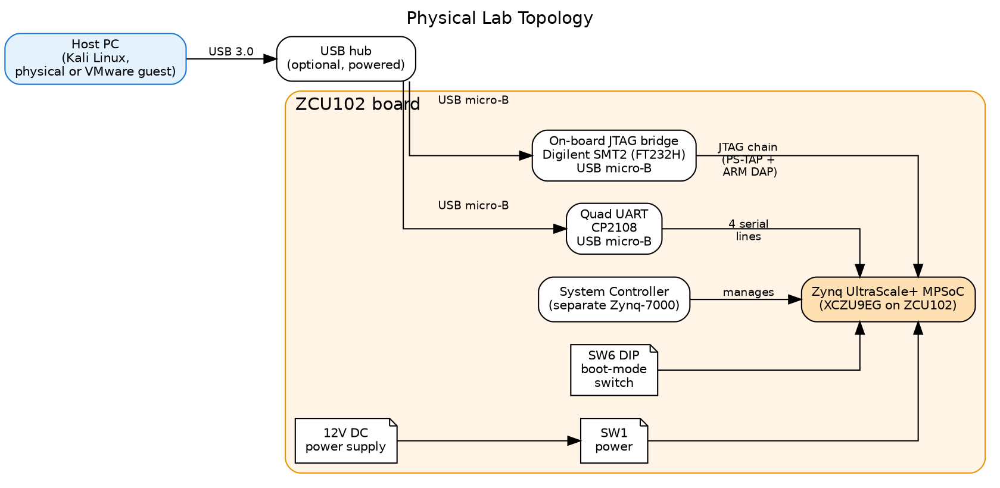
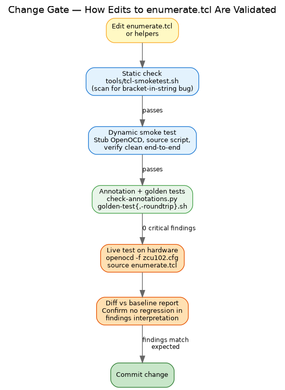

# JTAG Enumeration Lab Setup and Test Architecture

This document is the operational companion to the three-volume whitepaper.
Where the whitepaper covers *what* the enumeration workflow finds and *how
to interpret it*, this document covers *what hardware and software to
buy and install* and *how the change-validation framework works*.

Read this before standing up your own lab. Read it again when you want
to extend the toolchain.

---

## 1. Hardware

### 1.1 Reference board

The project's reference board is the AMD **ZCU102 Evaluation Kit**. All
captured data, sample reports, and case studies in the whitepaper
series come from a ZCU102 running in JTAG-idle mode.

| Item | Spec | Notes |
|---|---|---|
| Board | AMD ZCU102 Evaluation Kit | Built around XCZU9EG silicon, 4-core A53 |
| AMD part number | EK-U1-ZCU102-G | Order from AMD or distributor (Avnet, Digi-Key, Mouser) |
| Approx. cost | ~$3,000 USD | Educational pricing may be available |
| Power | 12V DC, 5A barrel jack | Use the included PSU |

The workflow generalizes to any ZynqMP-based board (ZCU104, ZCU106,
Ultra96, custom XCZU* designs, RFSoC ZCU111/208/216). The toolchain
detects variant differences via the IDCODE PART_ID and adapts.

### 1.2 Host machine

| Item | Minimum | Recommended |
|---|---|---|
| OS | Kali Linux (any recent release) | Kali rolling on bare metal, or VMware Workstation 17+ guest |
| RAM | 8 GB | 16 GB |
| Disk | 50 GB free | 150 GB free (allows Vitis install later) |
| USB | USB 2.0 ports | USB 3.0 (powered hub recommended — see §1.3) |

VMware guest is fully supported and is the project's reference
configuration. USB passthrough caveats are in §2.3.

### 1.3 Cables and accessories

| Item | Notes |
|---|---|
| USB micro-B cable × 2 | One for JTAG (`U33`), one for UART (`U40`). Quality matters; use known-good cables. |
| Powered USB hub | Optional but recommended in VMware setups — keeps the FT232H stable across guest restarts. |
| Monitor + HDMI cable | Optional. Useful when booting from SD to see Linux console. Not required for JTAG-only work. |
| MicroSD card (≥ 16 GB) | Optional. Only required when you want to boot from SD for the booted-state enumeration baseline. |
| Antistatic mat / strap | Recommended whenever the board is unboxed or handled. |

### 1.4 Physical topology

The connections look like this:



Key things to understand from this diagram:

- The ZCU102 has **two distinct USB micro-B endpoints**. Both must be
  cabled to the host to do the full workflow.
- **JTAG via FT232H** (`U33`) appears to the host as USB ID `0403:6014`
  with product string "Digilent USB Device." This is the interface
  `openocd/zcu102.cfg` selects.
- **UART via CP2108** (`U40`) appears as USB ID `10c4:ea71`, which
  enumerates as four serial devices `/dev/ttyUSB0` through `/dev/ttyUSB3`
  (mapping documented in `memory/reference_zcu102_ports.md`).
- The **System Controller** is a separate Zynq-7000 on the same board
  that manages power sequencing, I2C, voltage regulation, and the
  reset buttons. It's not normally a research target.
- The **SW6 DIP switch** sets the boot mode the BootROM reads at
  PS_POR_B release. All-ON = JTAG idle (the cleanest baseline for
  enumeration). Other positions select QSPI, SD, eMMC, USB boot.
- **SW1** is the power button. Pressing it toggles the SoC's power
  state without removing 12V from the board.

---

## 2. Software install

### 2.1 OpenOCD and base tools

These are required for the enumeration workflow itself:

```
sudo apt-get update
sudo apt-get install -y \
    openocd \
    tio \
    minicom \
    screen \
    usbutils
```

| Package | Purpose |
|---|---|
| `openocd` | JTAG host — runs the enumeration scripts |
| `tio` | Friendly serial terminal for UART monitoring |
| `minicom`, `screen` | Alternative serial terminals |
| `usbutils` | `lsusb` for autoconnect's USB scan |

### 2.2 Whitepaper generation tooling

Required only if you'll regenerate the PDF/DOCX artifacts:

```
sudo apt-get install -y \
    pandoc \
    texlive-latex-recommended \
    texlive-fonts-recommended \
    texlive-xetex \
    graphviz \
    imagemagick
```

| Package | Purpose |
|---|---|
| `pandoc` | Markdown → PDF/DOCX converter |
| `texlive-*` | LaTeX backend for PDF generation |
| `graphviz` | Renders the `.dot` figure sources to PNG |
| `imagemagick` | Image conversion and page preview rendering |

Total disk footprint for the whitepaper toolchain: ~600 MB.

### 2.3 udev rule for non-root FT232H access

By default, only root can talk to the FT232H. Without this rule
OpenOCD must be invoked with `sudo`, which is awkward and risky.

Create `/etc/udev/rules.d/99-ftdi-jtag.rules`:

```
SUBSYSTEM=="usb", ATTRS{idVendor}=="0403", ATTRS{idProduct}=="6014", \
    MODE="0666", GROUP="plugdev"
```

Then:

```
sudo udevadm control --reload-rules
sudo udevadm trigger
```

Unplug and replug the JTAG USB cable. Verify `lsusb` shows the device
and you can run OpenOCD without `sudo`.

### 2.4 VMware USB passthrough

If you're running Kali as a VMware guest, the JTAG and UART USB
devices need to be passed through to the guest, not consumed by the
host OS.

In VMware Workstation:

1. With the guest powered on, open **VM → Settings → USB Controller**.
   Confirm USB 3.0/3.1 compatibility is selected.
2. Plug in the JTAG cable. A toast notification appears in the guest
   asking whether to connect the device.
3. Alternatively, **VM → Removable Devices → Digilent USB Device → Connect**.
4. Repeat for the UART cable (`CP2108 USB Composite Device`).
5. Inside the guest, verify `lsusb` shows both devices:
   ```
   Bus 002 Device 003: ID 0403:6014 Future Technology Devices International, Ltd FT232H
   Bus 002 Device 004: ID 10c4:ea71 Silicon Labs CP2108 Quad UART Bridge
   ```

Known gotcha: if the board is powered off, the FT232H disappears from
USB enumeration entirely (it draws 3.3V from the board). Power the
board *first*, then connect USB.

---

## 3. Project repository setup

### 3.1 Clone

The project lives at `/home/kali/Desktop/research/JTAG` in this
deployment. Adjust paths for your environment.

```
mkdir -p ~/Desktop/research
cd ~/Desktop/research
# Clone or copy the project tree here
```

### 3.2 Directory layout

```
JTAG/
├── docs/                                  Documentation (start with README.md)
│   ├── README.md                            index
│   ├── 01..10*.md                           focused docs
│   ├── appendix-*.md
│   └── whitepaper/                          three-volume whitepaper series
│       ├── 01-foundation.{md,pdf,docx}
│       ├── 02-workflow.{md,pdf,docx}
│       ├── 03-enumeration-reveals.{md,pdf,docx}
│       ├── whitepaper-combined.pdf
│       ├── lab-setup.{md,pdf,docx}         (this document)
│       └── figures/                          Graphviz sources + PNGs
├── tools/
│   ├── interpret.py                         capture JSON → findings markdown
│   ├── interpret_lib.py                     Capture / Annotation / Finding
│   ├── regenerate-qemu-regs.py              regenerate register library
│   ├── generate-mock-seed.py                raw JSON → mock harness seed
│   ├── check-annotations.py                 annotation-module self-test
│   ├── golden-test.sh                       interpret.py vs golden md
│   ├── golden-test-roundtrip.sh             enumerate.tcl via mock vs golden
│   └── tcl-smoketest.sh                     one-command 4-layer test suite
├── openocd/
│   ├── zcu102.cfg                           manual board config
│   ├── enumerate.tcl                        main enumeration script (18 sections)
│   ├── discover.tcl                         first-contact chain probe
│   └── lib/                                  shared Tcl libraries (incl. mock-openocd.tcl)
├── docs/
│   ├── annotations/zynqmp_{security,general}.py    field annotations
│   └── findings/zynqmp_rules.py                    cross-register rules
├── reports/                                  enumeration reports (timestamped)
├── tests/golden/zcu102-jtag-idle/            frozen test fixtures
└── logs/                                     serial captures
```

### 3.3 First-time verification

After install, confirm everything works without the board attached:

```
cd ~/Desktop/research/JTAG
./tools/tcl-smoketest.sh
```

Expected output:

```
PASS: enumerate.tcl parses and runs end-to-end under stubs
...
Summary: 2 verified, 0 unverifiable, 4 discrepancies
                                       (CRITICAL=0 MAJOR=4 MINOR=0 INFO=0)
```

The 4 MAJOR findings are on `CSU_IDCODE` (IEEE 1149.1 standard fields,
known acceptable — see Volume 2 §1.4 for context).

### 3.4 First-time live verification

With the board powered and USB passed through:

```
# Optional: confirm the JTAG chain matches expectation
openocd -f openocd/zcu102.cfg -c "init; source openocd/discover.tcl; shutdown"
# Capture
openocd -f openocd/zcu102.cfg -c "init; source openocd/enumerate.tcl; shutdown"
```

Expected: a markdown report appears in `reports/` and §2 of the
report identifies the chip as `XCZU9 (EG/CG)` (or whatever variant
your board uses).

---

## 4. Test architecture — how changes are validated

The enumeration tooling enforces a gating workflow for any change to
the enumeration script or its libraries. This catches bug classes
that have repeatedly bitten this project: hand-typed bit fields
drifting from silicon truth, Tcl bracket-in-string substitution,
register-name collisions at coincidental addresses.



### 4.1 Gate 1 — static check

`tools/tcl-smoketest.sh` scans `openocd/enumerate.tcl` for the
bracket-in-string pattern that has caused mid-script crashes in past
versions:

```
"...field-name[N:M]..."
```

inside a `[list ...]`, `[lappend ...]`, `[format ...]`, or
`[expr ...]` context. Tcl interprets `[N:M]` as command substitution
and fails when "N:M" isn't a valid command. The static check
prevents this from reaching a live run.

### 4.2 Gate 2 — dynamic smoke test

The same `tcl-smoketest.sh` stubs every OpenOCD-specific command
(`targets`, `safe_rd`, `safe_wr`, `read_memory`, `halt`, etc.) and
runs `enumerate.tcl` end-to-end under `tclsh`. Any uncaught Tcl
error fails the test.

This catches:

- Tcl syntax errors (unclosed braces, malformed `expr`)
- Undefined-variable references
- Bad `foreach` lists
- The bracket-in-string bugs that the static check missed

Runs in under a second, no board needed.

### 4.3 Gate 3 — register-layout consistency (built into the script)

Bit-layout consistency is no longer a separate audit step — it's
structural. Every register read in `enumerate.tcl` goes through
`dump_reg_qemu <ADDR>`, which looks up bit fields directly from
`openocd/lib/zynqmp-regs-qemu.tcl` (auto-generated by
`tools/regenerate-qemu-regs.py` from QEMU C sources). There is no
hand-typed bit position anywhere in the capture path, so drift between
the script and QEMU's model is structurally impossible.

The standalone audit tool that previously cross-checked hand-typed
`dump_reg` calls (`tools/audit-bit-layouts.py`) was retired in the
May 2026 cleanup because it had nothing to audit — all sites
delegate to QEMU.

What replaces it:

- `tools/check-annotations.py` — sanity check for the annotation
  modules: every `Annotation`'s `(register, field)` pair must resolve
  to a real register in `zynqmp-regs-qemu.tcl`; wildcards (`register="*"`)
  must match at least one register; no duplicates.
- `tools/golden-test.sh` + `tools/golden-test-roundtrip.sh` — diff
  produced output against frozen golden artifacts (raw JSON, raw
  markdown, interpreted markdown). Either drift fires a test failure.
- All three gates run from `./tools/tcl-smoketest.sh`.

Earlier discrepancy categories (kept for historical context):

| Severity | What it means |
|---|---|
| **CRITICAL** | Field placed at wrong bit position OR register at wrong address (different register lives there in QEMU) |
| **MAJOR** | Field name doesn't match QEMU's at that bit position; phantom field that doesn't exist in QEMU |
| **MINOR** | Script omits a field QEMU has at that bit position |
| **INFO** | Naming-style differences (e.g., `AES_RDLK` vs `AES_RD_LOCK`) — same field, different abbreviation |

The audit currently shows 0 CRITICAL, 4 MAJOR (all known-acceptable
IEEE 1149.1 standard fields on `CSU_IDCODE`), 0 MINOR, 0 INFO. Any
new CRITICAL or MAJOR introduced by a change must be resolved before
the change merges.

The audit also has an `--address-only` mode that runs faster and
only verifies register name matches at each address — useful for
catching coincidental-address bugs (the script names register X at
address A, but QEMU has register Y at A).

### 4.4 Gate 4 — live test on hardware

Once the offline gates pass, run the script on the ZCU102:

```
openocd -f openocd/zcu102.cfg -c "init; source openocd/enumerate.tcl"
```

The script's cleanup re-asserts A53 reset at the end of each run, so
consecutive runs on the same boot session work without a power
cycle.

### 4.5 Gate 5 — diff against baseline report

After a live run, compare the new report against a saved baseline:

```
diff -u reports/enumerate-<known-good-timestamp>.md \
        reports/enumerate-<new-timestamp>.md | less
```

The reports have stable structure so meaningful changes appear as
specific register-value or findings-text deltas, not noise.

Confirm:

- Section §2 still identifies the correct variant
- Section §4 findings interpretations are consistent with the
  observed register values (e.g., if `JTAG_DAP_CFG.SPIDEN = 1`, the
  findings text says "WIDE OPEN — secure-world debug enabled")
- No new unexpected `ERR` or `BLOCKED` values in late sections

If diffs make sense, commit the change.

### 4.6 Why the gates exist

The gates aren't bureaucracy — they exist because each one has
caught a real bug in the project history:

- **Static check**: caught at least three independent bracket-in-string
  bugs during whitepaper-era editing
- **Smoke test**: caught Tcl parse errors before any board time was
  wasted
- **Audit**: surfaced 89 bit-layout discrepancies in the pre-audit
  script — many fundamental (e.g., 20 fabricated per-core bits on
  `JTAG_DAP_CFG` that didn't exist in real hardware)
- **Diff**: catches the case where bit math is correct but the
  interpretation text wasn't updated to match — a finding can be
  silently wrong even when the values it cites are right

Skip any gate and you reintroduce the bug class it was built to
prevent.

---

## 5. Reproduction-of-results checklist

To reproduce the ZCU102 case study from Volume 2 §3 of the
whitepaper:

| # | Step | Expected result |
|---|---|---|
| 1 | Power off the board (SW1 OFF), wait 5 seconds | All LEDs off |
| 2 | Set SW6 boot mode DIP switch to all-ON (JTAG idle) | Visual check |
| 3 | Connect JTAG USB and UART USB cables to host | `lsusb` shows `0403:6014` and `10c4:ea71` |
| 4 | Pass both USB devices through to the VM guest if applicable | Same — verified inside guest |
| 5 | Power on the board (SW1 ON) | Status LEDs come up; FT232H stays enumerated |
| 6 | `openocd -f openocd/zcu102.cfg -c "init; source openocd/discover.tcl; shutdown"` | TAPs + IDCODEs + AP list match the expected part |
| 7 | `openocd -f openocd/zcu102.cfg -c "init; source openocd/enumerate.tcl; shutdown"` | Report file appears in `reports/` after ~10s |
| 8 | Open the report; check §2 chip identity | `XCZU9 (EG/CG) (4-core A53, family=zynqmp)` |
| 9 | Check §4 security state findings | SPIDEN=1, SPNIDEN=1 ("WIDE OPEN" findings), `EFUSE.SEC_CTRL = 0x00000000` |
| 10 | Check §8 A53 release | A53.0 halted at PC `0xFFFC0000`, CPSR `0x000003cd` (EL3H) |
| 11 | Confirm cleanup re-asserted A53 reset | Final section shows `RST_FPD_APU after = 0x00003d0f` |

If any step diverges from expected, check:

- USB passthrough is current (VMware sometimes drops devices on
  guest reboot)
- Board is fully powered (FT232H needs 3.3V from board)
- No other OpenOCD instance is running (`pgrep openocd`)
- For step 6: SW6 is fully all-ON (any bit wrong selects a different
  boot mode)

---

## 6. Common operational issues

| Symptom | Likely cause | Fix |
|---|---|---|
| `lsusb` doesn't show FT232H or CP2108 | Board powered off, or USB not passed through | Power board; check VMware USB passthrough |
| OpenOCD: `JTAG-DP STICKY ERROR` at init | A53 was released in prior run, cleanup didn't complete | Power-cycle board (SW1 OFF, 5s, ON); retry |
| `Permission denied` on `/dev/ttyUSB*` | User not in `dialout` or `plugdev` group | `sudo usermod -aG dialout,plugdev $USER`; re-login |
| Enumeration report ends partway through | Tcl error in script | Check stdout for the error line; run `tcl-smoketest.sh` |
| `discover.tcl` shows no APs | Target config didn't load, or DAP examination failed | Verify board config, re-run autoconnect |
| Audit shows CRITICAL findings | Wrong address or fabricated field introduced | Fix before committing |
| Combined PDF rebuild slow | LaTeX font setup runs first time on a system | Subsequent runs are fast (~5s per volume) |

---

## 7. Regenerating the whitepaper artifacts

When the markdown source files in `docs/whitepaper/*.md` are edited,
regenerate the PDFs and DOCXs:

```
cd ~/Desktop/research/JTAG/docs/whitepaper

# PDFs (per volume)
for vol in 01-foundation 02-workflow 03-enumeration-reveals lab-setup; do
    pandoc --defaults=pandoc-defaults.yaml -o "${vol}.pdf" "${vol}.md"
done

# Combined PDF
pandoc --defaults=pandoc-defaults.yaml -o whitepaper-combined.pdf \
    01-foundation.md 02-workflow.md 03-enumeration-reveals.md

# DOCXs
for vol in 01-foundation 02-workflow 03-enumeration-reveals lab-setup; do
    pandoc --defaults=pandoc-defaults-docx.yaml -o "${vol}.docx" "${vol}.md"
done
```

When figure source files (`docs/whitepaper/figures/*.dot`) are edited,
regenerate the PNGs:

```
cd docs/whitepaper/figures
for f in *.dot; do
    dot -Tpng -Gdpi=150 -Gsplines=ortho "$f" -o "${f%.dot}.png"
done
```

Then rebuild the affected PDFs.

When the QEMU register sources at `/opt/xilinx/qemu/hw/misc/*.c` are
updated (rare — only when Xilinx QEMU is upgraded):

```
python3 tools/regenerate-qemu-regs.py
./tools/tcl-smoketest.sh        # confirm capture + interpret still match goldens
```

---

## See also

- `01-foundation.md`, `02-workflow.md`, `03-enumeration-reveals.md` —
  the three-volume whitepaper series
- `docs/05-enumeration-tool.md` — full `enumerate.tcl` manual
- `docs/09-discover-tool.md` — `discover.tcl` reference
- `docs/11-enumerated-attributes.md` — enumerated security-attribute catalog
- `docs/appendix-a-recovery.md` — DAP-wedge recovery procedures
- `docs/appendix-b-references.md` — Xilinx and ARM document references
